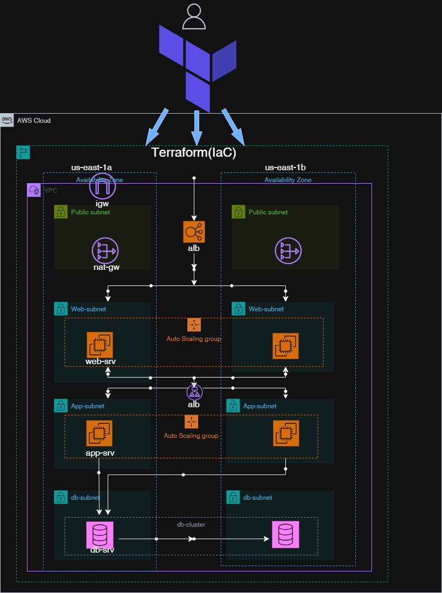

## Terraform AWS 3-Tier Enterprise Architecture
📌 Project Overview

This project demonstrates how to design and provision a secure, scalable, and production-style 3-tier web application infrastructure on AWS using Terraform (Infrastructure as Code).

The infrastructure follows industry best practices by separating concerns into network, web, and database layers, ensuring security, maintainability, and repeatability.

## 🏗️ Architecture Overview



🎯 Objectives
 - Implement Infrastructure as Code (IaC) using Terraform following industry best practices
 - Design and deploy a secure, production-grade AWS 3-Tier Architecture
 - Apply cloud security and networking best practices (private subnets, least privilege access)
 - Enable repeatable, environment-agnostic deployments with clean teardown (terraform destroy)
 - Demonstrate real-world DevOps and cloud engineering skills beyond tutorials

## 📂 Repository Structure

```text
terraform-aws-3tier-enterprise/
├── dev/
│   ├── main.tf
│   ├── provider.tf
│   ├── variables.tf
│   ├── outputs.tf
│   ├── backend.tf
│   └── terraform.tfvars.example
│
├── modules/
│   ├── network/
│   ├── security/
│   ├── alb/
│   ├── asg/
│   └── database/
│
├── docs/
│   ├── architecture/
│   │   └── aws-3tier-architecture.png
│   └── troubleshooting/
│       ├── asg-free-tier-error.png
│       ├── terraform-state-drift.png
│       ├── alb-503-error.png
│       └── alb-recovery-success.png
│
└── README.md

```
⚠️ Challenges & Lessons Learned (Summary)
   - AWS Free Tier changes caused Auto Scaling failures: t2.micro and t3.micro were no longer eligible or restricted, requiring a shift to t4g.micro (Graviton).
   - Terraform state drift occurred when Terraform reported “No changes” despite code updates, due to remote state misalignment and missing reinitialization.
   - ALB HTTP 503 errors were encountered when targets were unhealthy, highlighting the importance of correct security group chaining, health checks, and instance readiness.
Key lesson: Production cloud environments demand continuous adaptation—understanding provider policies, Terraform state management, and load balancer health is critical for reliable deployments.


